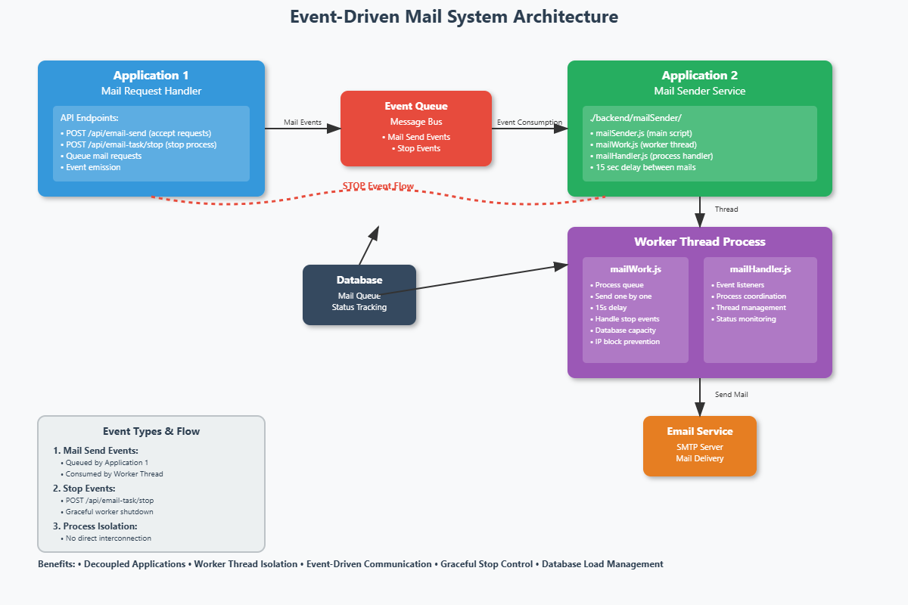

# ArticalsMaster

Installation dependencies
=========================

Node js :- 20.18.2
Postgresql :- 16

Installation steps

1) Go to ./backend and run npm install ---force.
2) Go to ./forentend and npm install --force.
3) After it node ./backend/config/syncModel.js run.
4) After it node ./backend/importData.js.
5) npm run start for backend api.
6) npm run dev for ui.
7) Add ./backend/env file details from your side.
8) Mail sending based on the event driven architecture from technical side

For ai use:- https://aistudio.google.com/

Gemini 2.5 always implement for summary generate.